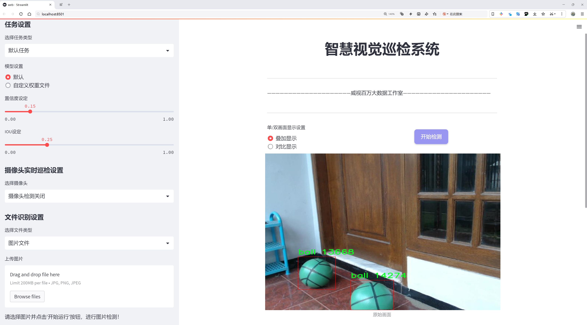
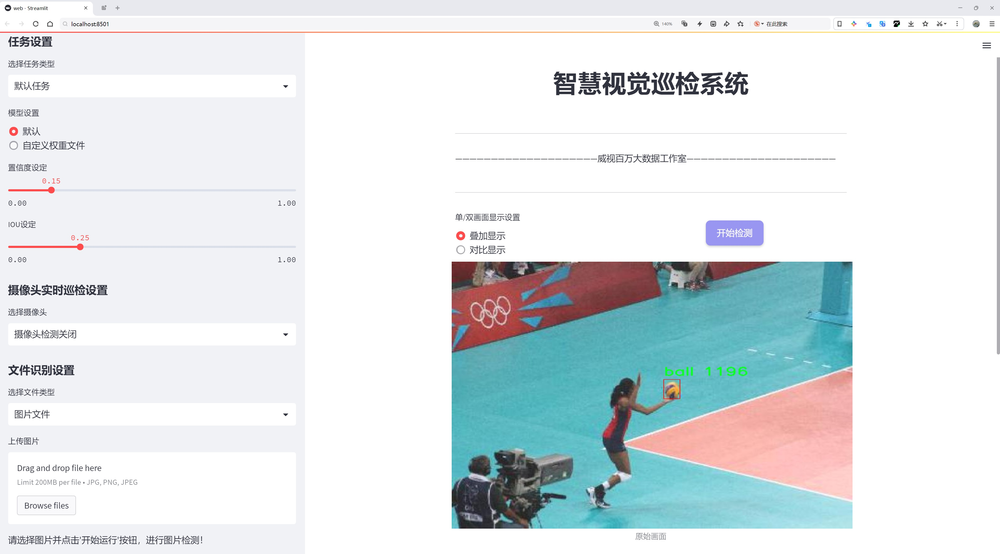
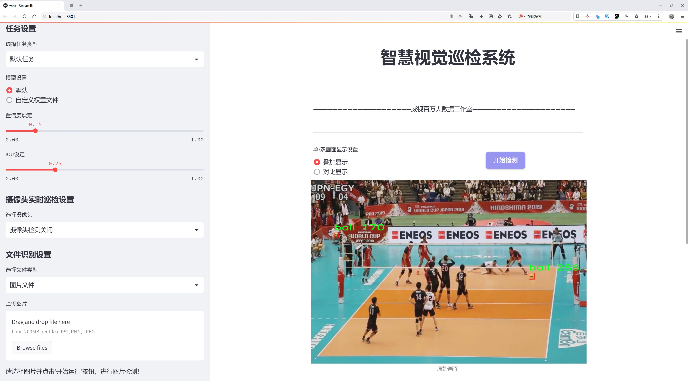
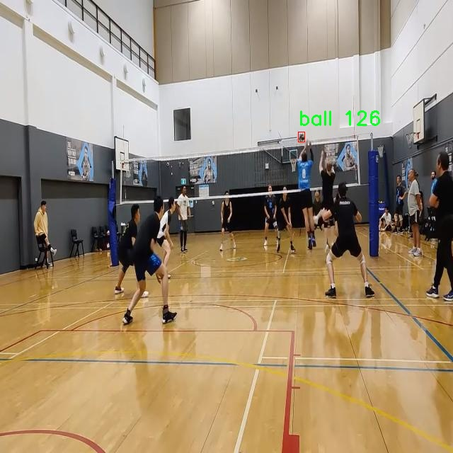
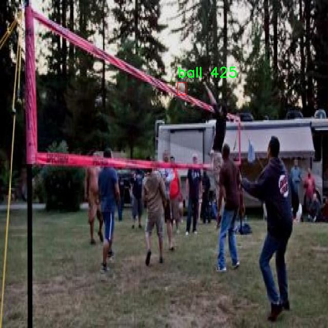
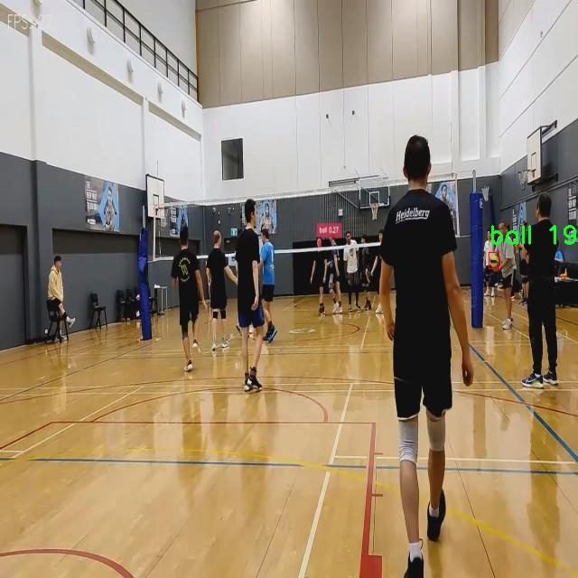
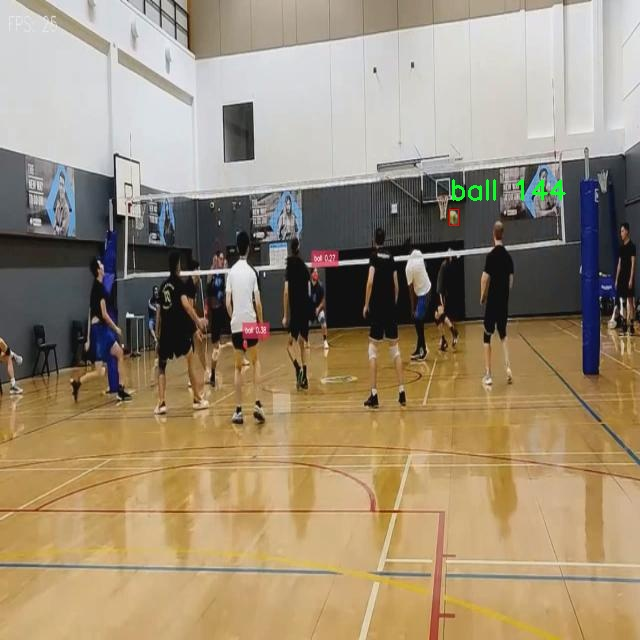
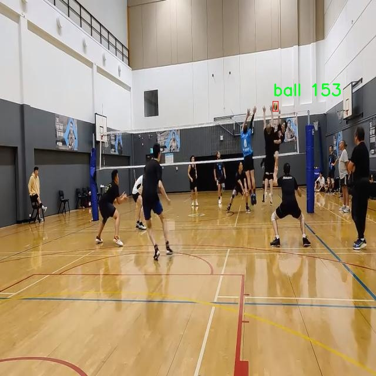

# 体育球体检测检测系统源码分享
 # [一条龙教学YOLOV8标注好的数据集一键训练_70+全套改进创新点发刊_Web前端展示]

### 1.研究背景与意义

项目参考[AAAI Association for the Advancement of Artificial Intelligence](https://gitee.com/qunmasj/projects)

项目来源[AACV Association for the Advancement of Computer Vision](https://kdocs.cn/l/cszuIiCKVNis)

研究背景与意义

随着人工智能技术的迅猛发展，计算机视觉在各个领域的应用日益广泛，尤其是在体育领域，物体检测技术的进步为运动分析、裁判辅助和观众体验提升等方面提供了新的可能性。体育赛事中，球体的检测与追踪是实现运动分析和战术研究的基础，然而传统的检测方法往往面临着准确性不足、实时性差等问题。因此，基于深度学习的物体检测技术，尤其是YOLO（You Only Look Once）系列模型，逐渐成为研究的热点。

YOLOv8作为YOLO系列的最新版本，具备了更高的检测精度和更快的推理速度，能够在复杂的体育场景中有效识别和定位目标物体。通过对YOLOv8模型的改进，可以进一步提升其在体育球体检测中的表现。具体而言，改进的方向可能包括优化网络结构、增强数据集的多样性、调整超参数等，以适应体育场景中球体的快速移动和多变背景。这些改进不仅可以提高模型的准确性，还能增强其在实时应用中的实用性。

本研究将基于“vv_dataset_only_ball”数据集进行模型训练和测试。该数据集包含7200张图像，专注于单一类别的球体检测，为模型的训练提供了丰富的样本。这一数据集的构建使得模型能够专注于球体的特征提取，进而提高检测的准确性和鲁棒性。通过对该数据集的深入分析，我们可以识别出影响检测效果的关键因素，如光照变化、背景复杂度以及球体的不同姿态等。这些因素的分析将为后续的模型改进提供重要的参考依据。

在体育赛事中，实时的球体检测系统不仅能够为教练和运动员提供战术分析的依据，还能为观众提供更为丰富的赛事体验。例如，通过对球体的精准追踪，可以实现动态回放、战术演示等功能，提升观众的参与感和理解度。此外，借助改进的YOLOv8模型，裁判在比赛中的判罚也能更加准确和高效，减少人为错误的发生。

综上所述，基于改进YOLOv8的体育球体检测系统的研究具有重要的理论价值和实际意义。通过对该系统的开发与应用，我们不仅能够推动计算机视觉技术在体育领域的进一步发展，还能为相关产业提供技术支持，促进体育赛事的智能化和数字化转型。未来，随着数据集的不断扩展和模型算法的持续优化，基于深度学习的球体检测系统有望在更广泛的应用场景中发挥重要作用，助力体育科技的创新与发展。

### 2.图片演示







##### 注意：由于此博客编辑较早，上面“2.图片演示”和“3.视频演示”展示的系统图片或者视频可能为老版本，新版本在老版本的基础上升级如下：（实际效果以升级的新版本为准）

  （1）适配了YOLOV8的“目标检测”模型和“实例分割”模型，通过加载相应的权重（.pt）文件即可自适应加载模型。

  （2）支持“图片识别”、“视频识别”、“摄像头实时识别”三种识别模式。

  （3）支持“图片识别”、“视频识别”、“摄像头实时识别”三种识别结果保存导出，解决手动导出（容易卡顿出现爆内存）存在的问题，识别完自动保存结果并导出到tempDir中。

  （4）支持Web前端系统中的标题、背景图等自定义修改，后面提供修改教程。

  另外本项目提供训练的数据集和训练教程,暂不提供权重文件（best.pt）,需要您按照教程进行训练后实现图片演示和Web前端界面演示的效果。

### 3.视频演示

[3.1 视频演示](https://www.bilibili.com/video/BV1yMxweiE55/)

### 4.数据集信息展示

##### 4.1 本项目数据集详细数据（类别数＆类别名）

nc: 1
names: ['ball']


##### 4.2 本项目数据集信息介绍

数据集信息展示

在本研究中，我们采用了名为“vv_dataset_only_ball”的数据集，以训练和改进YOLOv8的体育球体检测系统。该数据集专注于单一类别的物体检测，具体为“ball”，其类别数量为1。这一特定的聚焦使得数据集在体育场景中的应用尤为有效，尤其是在涉及到球类运动的环境中，如足球、篮球、网球等。通过精确的标注和丰富的样本，数据集为模型提供了必要的训练基础，旨在提升其在动态场景下的检测能力和准确性。

“vv_dataset_only_ball”数据集的构建考虑到了多样性和代表性，确保了在不同条件下的训练样本能够覆盖各种可能的场景。数据集中包含了不同类型的球体图像，这些图像在不同的光照条件、角度和背景下进行拍摄，模拟了真实世界中可能遇到的各种情况。这种多样性不仅增强了模型的鲁棒性，还提高了其在实际应用中的适应能力。通过对数据集的精心设计，我们能够确保YOLOv8在训练过程中学习到丰富的特征，从而在实际检测中表现出色。

在数据标注方面，数据集采用了高标准的标注流程，确保每一张图像中的球体都被准确地框选和标记。这一过程不仅包括对球体的精确定位，还考虑到了球体在不同运动状态下的表现。这样的细致标注使得模型能够更好地理解球体的运动轨迹和变化，进而提高检测的准确性和实时性。通过这样的标注策略，数据集为YOLOv8提供了强有力的支持，使其能够在复杂的体育场景中有效识别和追踪球体。

此外，数据集的规模也是其重要特征之一。我们确保“vv_dataset_only_ball”数据集包含了足够数量的样本，以满足深度学习模型对数据量的需求。充足的训练样本不仅能够提高模型的泛化能力，还能有效防止过拟合现象的发生。通过对数据集的持续扩展和更新，我们力求在不断变化的体育环境中保持模型的有效性和准确性。

总之，“vv_dataset_only_ball”数据集的设计和构建充分考虑了体育球体检测的实际需求，结合了多样的样本、精确的标注和合理的规模，为YOLOv8的训练提供了坚实的基础。随着该数据集的应用，我们期待能够在体育场景中实现更高效、更准确的球体检测，为相关领域的研究和应用提供有力支持。通过不断优化和改进，我们相信该数据集将为未来的研究和技术发展开辟新的方向，推动体育智能检测系统的进步。











### 5.全套项目环境部署视频教程（零基础手把手教学）

[5.1 环境部署教程链接（零基础手把手教学）](https://www.ixigua.com/7404473917358506534?logTag=c807d0cbc21c0ef59de5)


[5.2 安装Python虚拟环境创建和依赖库安装视频教程链接（零基础手把手教学）](https://www.ixigua.com/7404474678003106304?logTag=1f1041108cd1f708b01a)

### 6.手把手YOLOV8训练视频教程（零基础小白有手就能学会）

[6.1 手把手YOLOV8训练视频教程（零基础小白有手就能学会）](https://www.ixigua.com/7404477157818401292?logTag=d31a2dfd1983c9668658)

### 7.70+种全套YOLOV8创新点代码加载调参视频教程（一键加载写好的改进模型的配置文件）

[7.1 70+种全套YOLOV8创新点代码加载调参视频教程（一键加载写好的改进模型的配置文件）](https://www.ixigua.com/7404478314661806627?logTag=29066f8288e3f4eea3a4)

### 8.70+种全套YOLOV8创新点原理讲解（非科班也可以轻松写刊发刊，V10版本正在科研待更新）

由于篇幅限制，每个创新点的具体原理讲解就不一一展开，具体见下列网址中的创新点对应子项目的技术原理博客网址【Blog】：


[8.1 70+种全套YOLOV8创新点原理讲解链接](https://gitee.com/qunmasj/good)

### 9.系统功能展示（检测对象为举例，实际内容以本项目数据集为准）

图9.1.系统支持检测结果表格显示

  图9.2.系统支持置信度和IOU阈值手动调节

  图9.3.系统支持自定义加载权重文件best.pt(需要你通过步骤5中训练获得)

  图9.4.系统支持摄像头实时识别

  图9.5.系统支持图片识别

  图9.6.系统支持视频识别

  图9.7.系统支持识别结果文件自动保存

  图9.8.系统支持Excel导出检测结果数据


### 10.原始YOLOV8算法原理

原始YOLOv8算法原理

YOLOv8作为目标检测领域的最新代表，延续了YOLO系列的高效性与准确性，同时在多个方面进行了创新与优化。该算法的设计理念围绕着如何在保证检测精度的前提下，提升模型的运行速度与效率。YOLOv8的整体架构由输入层、主干网络、颈部网络和头部网络四个主要组件构成，形成了一个高效的目标检测流水线。

在YOLOv8的输入层，首先对输入图像进行缩放，以适应模型的指定输入尺寸。这一过程确保了无论输入图像的原始大小如何，模型都能以一致的方式处理图像，从而保持检测结果的稳定性。接下来，主干网络通过一系列卷积操作对图像进行下采样，提取出重要的特征信息。每个卷积层不仅包含批归一化操作，还采用了SiLU激活函数，这种激活函数在非线性变换上表现优异，有助于模型捕捉更复杂的特征。

主干网络的核心在于C2f块的引入，这一模块借鉴了YOLOv7中的E-ELAN结构，通过跨层分支连接来增强模型的梯度流。这种设计使得特征的传递更加高效，尤其是在深层网络中，梯度的流动往往会因为层数的增加而变得不稳定。C2f块通过增加残差连接，提升了特征的丰富性，使得模型在面对复杂场景时，能够更好地进行目标检测。

在主干网络的末尾，YOLOv8引入了SPPFl块，该模块通过三个最大池化层处理多尺度特征，进一步增强了网络的特征抽象能力。多尺度特征的提取对于目标检测至关重要，因为在实际应用中，目标的大小和形状可能各不相同。SPPFl块的设计确保了模型能够有效地捕捉到不同尺度的目标信息，从而提升了检测的准确性。

接下来，颈部网络的设计采用了FPNS（Feature Pyramid Network）和PAN（Path Aggregation Network）结构，旨在融合来自不同尺度特征图的信息。这一过程是YOLOv8的重要创新之一，通过对不同层次特征的有效融合，模型能够更全面地理解图像内容，并为后续的检测头提供更为丰富的特征信息。

在头部网络中，YOLOv8采用了解耦的检测头结构，分别计算回归和类别的损失。这一设计使得模型在处理目标检测任务时，能够更加专注于各自的任务，避免了传统方法中分类和回归损失相互干扰的问题。此外，YOLOv8在损失计算上引入了变焦损失策略，通过这种新颖的方式，模型在分类损失的计算上更加精确。同时，边界框损失的计算也采用了数据平均保真度损失和完美交并比损失，这种细致的损失设计使得YOLOv8在边界框的回归上表现出色。

YOLOv8的另一个显著特点是其模型的多样性。为了满足不同应用场景的需求，YOLOv8提供了n、s、m、l、x五种不同尺度的模型。这些模型并不是简单地遵循一套固定的缩放系数，而是在改变缩放系数的同时，灵活调整主干网络的通道数，以达到最佳的模型性能。这种灵活性使得YOLOv8能够在多种环境下进行高效的目标检测，适应性极强。

在训练过程中，YOLOv8也进行了多项创新。它在数据增强部分，采用了动态Task-Aligned Assigner样本分配策略，并在训练的最后10个epoch中关闭马赛克增强。这种策略的实施，使得模型在训练过程中能够更好地适应数据的多样性，提高了模型的泛化能力。

综上所述，YOLOv8通过一系列创新设计，成功地在目标检测领域树立了新的标杆。其高效的特征提取机制、灵活的模型结构以及精细的损失计算策略，使得YOLOv8在处理复杂目标检测任务时，展现出了卓越的性能。随着YOLOv8的广泛应用，未来在智能监控、自动驾驶、医疗影像等领域的潜力将更加显著，推动目标检测技术的进一步发展。


### 11.项目核心源码讲解（再也不用担心看不懂代码逻辑）

#### 11.1 ui.py

以下是对给定代码的核心部分进行提炼和详细注释的版本：

```python
import sys
import subprocess

def run_script(script_path):
    """
    使用当前 Python 环境运行指定的脚本。

    Args:
        script_path (str): 要运行的脚本路径

    Returns:
        None
    """
    # 获取当前 Python 解释器的路径
    python_path = sys.executable

    # 构建运行命令，使用 streamlit 运行指定的脚本
    command = f'"{python_path}" -m streamlit run "{script_path}"'

    # 执行命令并等待其完成
    result = subprocess.run(command, shell=True)
    
    # 检查命令执行的返回码，0 表示成功，非0表示出错
    if result.returncode != 0:
        print("脚本运行出错。")

# 主程序入口
if __name__ == "__main__":
    # 指定要运行的脚本路径
    script_path = "web.py"  # 这里可以替换为实际的脚本路径

    # 调用函数运行指定的脚本
    run_script(script_path)
```

### 代码核心部分分析：
1. **导入模块**：
   - `sys`：用于获取当前 Python 解释器的路径。
   - `subprocess`：用于执行外部命令。

2. **`run_script` 函数**：
   - 该函数接受一个脚本路径作为参数，并使用当前 Python 环境运行该脚本。
   - 使用 `sys.executable` 获取当前 Python 解释器的路径，以确保使用正确的 Python 环境。
   - 构建命令字符串，使用 `streamlit` 运行指定的脚本。
   - 使用 `subprocess.run` 执行命令，并检查返回码以确定脚本是否成功运行。

3. **主程序入口**：
   - 通过 `if __name__ == "__main__":` 确保该部分代码仅在直接运行该脚本时执行。
   - 指定要运行的脚本路径（这里是 `web.py`）。
   - 调用 `run_script` 函数来执行指定的脚本。

### 代码注释：
- 代码中每个重要步骤都有详细的中文注释，解释了其功能和目的，以便于理解和维护。

这个程序文件 `ui.py` 的主要功能是运行一个指定的 Python 脚本，具体来说是通过 Streamlit 框架来启动一个 Web 应用。程序的结构比较简单，主要包含了几个重要的部分。

首先，文件引入了一些必要的模块，包括 `sys`、`os` 和 `subprocess`。其中，`sys` 模块用于访问与 Python 解释器相关的变量和函数，`os` 模块提供了与操作系统交互的功能，而 `subprocess` 模块则用于在 Python 中启动新进程并与其交互。

接下来，定义了一个名为 `run_script` 的函数。这个函数接收一个参数 `script_path`，表示要运行的脚本的路径。函数内部首先获取当前 Python 解释器的路径，这样可以确保在正确的环境中运行脚本。然后，构建一个命令字符串，该命令使用当前的 Python 解释器来运行指定的脚本，并通过 Streamlit 的 `run` 命令来启动 Web 应用。

在执行命令时，使用了 `subprocess.run` 方法，这个方法会在一个新的进程中执行命令，并等待其完成。执行后，程序会检查返回的状态码，如果状态码不为零，表示脚本运行出错，程序会打印出相应的错误信息。

最后，在文件的主程序部分，使用 `if __name__ == "__main__":` 来确保只有在直接运行该文件时才会执行后面的代码。在这里，首先通过 `abs_path` 函数指定要运行的脚本路径（在此例中是 `web.py`），然后调用 `run_script` 函数来运行这个脚本。

总的来说，这个文件的功能是通过 Streamlit 框架来启动一个 Web 应用，且确保在当前 Python 环境中运行指定的脚本。程序的设计简单明了，易于理解和使用。

#### 11.2 70+种YOLOv8算法改进源码大全和调试加载训练教程（非必要）\ultralytics\trackers\byte_tracker.py

以下是经过简化和注释的核心代码部分，主要保留了 `STrack` 和 `BYTETracker` 类的关键功能和方法。

```python
import numpy as np
from .basetrack import BaseTrack, TrackState
from .utils import matching
from .utils.kalman_filter import KalmanFilterXYAH

class STrack(BaseTrack):
    """
    单目标跟踪表示，使用卡尔曼滤波进行状态估计。
    该类负责存储单个跟踪对象的所有信息，并基于卡尔曼滤波进行状态更新和预测。
    """

    shared_kalman = KalmanFilterXYAH()  # 共享的卡尔曼滤波器实例

    def __init__(self, tlwh, score, cls):
        """初始化新的STrack实例。"""
        # 将边界框的tlwh格式转换为内部存储格式
        self._tlwh = np.asarray(self.tlbr_to_tlwh(tlwh[:-1]), dtype=np.float32)
        self.kalman_filter = None  # 当前对象的卡尔曼滤波器
        self.mean, self.covariance = None, None  # 状态均值和协方差
        self.is_activated = False  # 跟踪是否被激活的标志

        self.score = score  # 置信度分数
        self.tracklet_len = 0  # 跟踪长度
        self.cls = cls  # 对象类别
        self.idx = tlwh[-1]  # 对象索引

    def predict(self):
        """使用卡尔曼滤波器预测对象的下一个状态。"""
        mean_state = self.mean.copy()  # 复制当前均值状态
        if self.state != TrackState.Tracked:
            mean_state[7] = 0  # 如果状态不是跟踪状态，设置速度为0
        self.mean, self.covariance = self.kalman_filter.predict(mean_state, self.covariance)

    def activate(self, kalman_filter, frame_id):
        """激活新的跟踪对象。"""
        self.kalman_filter = kalman_filter  # 设置卡尔曼滤波器
        self.track_id = self.next_id()  # 获取新的跟踪ID
        self.mean, self.covariance = self.kalman_filter.initiate(self.convert_coords(self._tlwh))  # 初始化状态

        self.tracklet_len = 0  # 重置跟踪长度
        self.state = TrackState.Tracked  # 设置状态为跟踪
        if frame_id == 1:
            self.is_activated = True  # 第一个帧激活跟踪
        self.frame_id = frame_id  # 当前帧ID
        self.start_frame = frame_id  # 开始帧ID

class BYTETracker:
    """
    BYTETracker: 基于YOLOv8的对象检测和跟踪算法。
    该类负责初始化、更新和管理视频序列中检测到的对象的跟踪。
    """

    def __init__(self, args, frame_rate=30):
        """初始化YOLOv8对象以跟踪对象。"""
        self.tracked_stracks = []  # 成功激活的跟踪列表
        self.lost_stracks = []  # 丢失的跟踪列表
        self.removed_stracks = []  # 移除的跟踪列表

        self.frame_id = 0  # 当前帧ID
        self.args = args  # 命令行参数
        self.max_time_lost = int(frame_rate / 30.0 * args.track_buffer)  # 最大丢失时间
        self.kalman_filter = self.get_kalmanfilter()  # 获取卡尔曼滤波器
        self.reset_id()  # 重置ID

    def update(self, results, img=None):
        """使用新的检测更新对象跟踪并返回跟踪对象的边界框。"""
        self.frame_id += 1  # 增加帧ID
        activated_stracks = []  # 激活的跟踪对象
        refind_stracks = []  # 重新找到的跟踪对象
        lost_stracks = []  # 丢失的跟踪对象
        removed_stracks = []  # 移除的跟踪对象

        scores = results.conf  # 检测分数
        bboxes = results.xyxy  # 检测边界框
        bboxes = np.concatenate([bboxes, np.arange(len(bboxes)).reshape(-1, 1)], axis=-1)  # 添加索引
        cls = results.cls  # 类别

        # 根据分数筛选检测
        remain_inds = scores > self.args.track_high_thresh
        dets = bboxes[remain_inds]  # 高分检测
        scores_keep = scores[remain_inds]  # 高分检测的分数
        cls_keep = cls[remain_inds]  # 高分检测的类别

        # 初始化跟踪
        detections = self.init_track(dets, scores_keep, cls_keep, img)
        # 将新检测的跟踪对象添加到tracked_stracks
        unconfirmed = [track for track in self.tracked_stracks if not track.is_activated]
        tracked_stracks = [track for track in self.tracked_stracks if track.is_activated]

        # 预测当前跟踪对象的位置
        strack_pool = self.joint_stracks(tracked_stracks, self.lost_stracks)
        self.multi_predict(strack_pool)

        # 计算距离并进行匹配
        dists = self.get_dists(strack_pool, detections)
        matches, u_track, u_detection = matching.linear_assignment(dists, thresh=self.args.match_thresh)

        # 更新匹配的跟踪对象
        for itracked, idet in matches:
            track = strack_pool[itracked]
            det = detections[idet]
            track.update(det, self.frame_id)  # 更新跟踪对象状态
            activated_stracks.append(track)

        # 处理未确认的跟踪对象
        for it in u_track:
            track = strack_pool[it]
            if track.state != TrackState.Lost:
                track.mark_lost()  # 标记为丢失
                lost_stracks.append(track)

        # 初始化新的跟踪对象
        for inew in u_detection:
            track = detections[inew]
            if track.score < self.args.new_track_thresh:
                continue
            track.activate(self.kalman_filter, self.frame_id)  # 激活新的跟踪对象
            activated_stracks.append(track)

        # 更新状态
        self.tracked_stracks = [t for t in self.tracked_stracks if t.state == TrackState.Tracked]
        self.tracked_stracks = self.joint_stracks(self.tracked_stracks, activated_stracks)
        self.lost_stracks.extend(lost_stracks)
        self.removed_stracks.extend(removed_stracks)

        return np.asarray(
            [x.tlbr.tolist() + [x.track_id, x.score, x.cls] for x in self.tracked_stracks if x.is_activated],
            dtype=np.float32)  # 返回激活的跟踪对象的边界框信息
```

### 代码注释说明：
1. **STrack 类**：负责单个目标的跟踪，使用卡尔曼滤波器进行状态预测和更新。
   - `__init__` 方法初始化跟踪对象的基本信息。
   - `predict` 方法使用卡尔曼滤波器预测下一个状态。
   - `activate` 方法激活新的跟踪对象。

2. **BYTETracker 类**：负责管理多个跟踪对象，更新状态并处理检测结果。
   - `__init__` 方法初始化跟踪器的基本状态。
   - `update` 方法处理新的检测结果，更新跟踪状态，并返回当前激活的跟踪对象的边界框信息。

该代码实现了一个基于卡尔曼滤波的多目标跟踪系统，能够在视频序列中实时跟踪多个对象。

该程序文件实现了一个基于YOLOv8的对象跟踪算法，主要包含两个类：`STrack`和`BYTETracker`。`STrack`类用于表示单个对象的跟踪，利用卡尔曼滤波器进行状态估计和更新。它的构造函数接收边界框的坐标、置信度分数和类别标签，并初始化跟踪状态。该类包含多个方法，用于预测对象的下一个状态、激活新跟踪、更新状态以及坐标转换等。

`BYTETracker`类则负责管理多个对象的跟踪，包括初始化、更新和维护跟踪状态。它使用卡尔曼滤波器来预测对象的新位置，并进行数据关联。该类的构造函数接收参数和帧率，初始化跟踪状态的列表以及卡尔曼滤波器。`update`方法是该类的核心，接收检测结果并更新跟踪状态。它通过计算跟踪对象和检测对象之间的距离，进行匹配和状态更新，处理丢失和移除的跟踪对象。

在更新过程中，`BYTETracker`首先将当前帧的跟踪对象与新检测结果进行关联，使用高置信度的检测结果进行初步匹配，然后对低置信度的检测结果进行二次匹配。最后，处理未确认的跟踪对象，并初始化新的跟踪对象。该类还提供了一些静态方法，用于合并和过滤跟踪对象列表，确保跟踪的准确性和有效性。

整体而言，该文件实现了一个高效的对象跟踪系统，结合了YOLOv8的检测能力和卡尔曼滤波的预测能力，适用于视频序列中的多目标跟踪任务。

#### 11.3 code\ultralytics\hub\utils.py

以下是代码中最核心的部分，并附上详细的中文注释：

```python
import os
import platform
import random
import sys
import threading
import time
from pathlib import Path
import requests
from ultralytics.utils import (
    ENVIRONMENT,
    LOGGER,
    ONLINE,
    RANK,
    SETTINGS,
    TESTS_RUNNING,
    TQDM,
    TryExcept,
    __version__,
    colorstr,
    get_git_origin_url,
    is_colab,
    is_git_dir,
    is_pip_package,
)

# 定义Ultralytics Hub的API和Web根地址
HUB_API_ROOT = os.environ.get("ULTRALYTICS_HUB_API", "https://api.ultralytics.com")
HUB_WEB_ROOT = os.environ.get("ULTRALYTICS_HUB_WEB", "https://hub.ultralytics.com")

# 定义前缀和帮助信息
PREFIX = colorstr("Ultralytics HUB: ")
HELP_MSG = "如果此问题持续存在，请访问 https://github.com/ultralytics/hub/issues 寻求帮助。"

def requests_with_progress(method, url, **kwargs):
    """
    使用指定的方法和URL进行HTTP请求，并可选地显示进度条。

    参数:
        method (str): 要使用的HTTP方法（例如 'GET', 'POST'）。
        url (str): 要发送请求的URL。
        **kwargs (dict): 传递给底层 `requests.request` 函数的其他关键字参数。

    返回:
        (requests.Response): HTTP请求的响应对象。
    """
    progress = kwargs.pop("progress", False)  # 从kwargs中获取进度参数
    if not progress:
        return requests.request(method, url, **kwargs)  # 如果没有进度，直接发送请求

    # 如果需要显示进度条
    response = requests.request(method, url, stream=True, **kwargs)  # 以流的方式请求
    total = int(response.headers.get("content-length", 0) if isinstance(progress, bool) else progress)  # 获取总大小
    try:
        pbar = TQDM(total=total, unit="B", unit_scale=True, unit_divisor=1024)  # 初始化进度条
        for data in response.iter_content(chunk_size=1024):  # 按块读取数据
            pbar.update(len(data))  # 更新进度条
        pbar.close()  # 关闭进度条
    except requests.exceptions.ChunkedEncodingError:  # 避免连接中断的警告
        response.close()
    return response  # 返回响应对象

def smart_request(method, url, retry=3, timeout=30, thread=True, code=-1, verbose=True, progress=False, **kwargs):
    """
    使用'requests'库进行HTTP请求，支持指数退避重试机制。

    参数:
        method (str): 请求使用的HTTP方法。选择 'post' 或 'get'。
        url (str): 要请求的URL。
        retry (int, optional): 放弃之前尝试的重试次数。默认为3。
        timeout (int, optional): 超时时间（秒），超时后放弃重试。默认为30。
        thread (bool, optional): 是否在单独的守护线程中执行请求。默认为True。
        code (int, optional): 请求的标识符，用于日志记录。默认为-1。
        verbose (bool, optional): 是否在控制台打印输出。默认为True。
        progress (bool, optional): 请求期间是否显示进度条。默认为False。
        **kwargs (dict): 传递给指定方法的请求函数的关键字参数。

    返回:
        (requests.Response): HTTP响应对象。如果请求在单独线程中执行，则返回None。
    """
    retry_codes = (408, 500)  # 仅对这些状态码进行重试

    @TryExcept(verbose=verbose)
    def func(func_method, func_url, **func_kwargs):
        """进行带重试和超时的HTTP请求，支持可选的进度跟踪。"""
        r = None  # 响应对象
        t0 = time.time()  # 记录开始时间
        for i in range(retry + 1):
            if (time.time() - t0) > timeout:  # 检查是否超时
                break
            r = requests_with_progress(func_method, func_url, **func_kwargs)  # 发送请求
            if r.status_code < 300:  # 2xx状态码表示成功
                break
            # 处理错误信息
            try:
                m = r.json().get("message", "没有JSON消息。")
            except AttributeError:
                m = "无法读取JSON。"
            if i == 0:  # 第一次请求时处理错误信息
                if r.status_code in retry_codes:
                    m += f" 重试 {retry} 次，超时 {timeout} 秒。" if retry else ""
                elif r.status_code == 429:  # 处理速率限制
                    h = r.headers  # 响应头
                    m = (
                        f"达到速率限制 ({h['X-RateLimit-Remaining']}/{h['X-RateLimit-Limit']}). "
                        f"请在 {h['Retry-After']} 秒后重试。"
                    )
                if verbose:
                    LOGGER.warning(f"{PREFIX}{m} {HELP_MSG} ({r.status_code} #{code})")
                if r.status_code not in retry_codes:
                    return r  # 如果不是重试状态码，直接返回响应
            time.sleep(2**i)  # 指数退避
        return r  # 返回响应对象

    args = method, url
    kwargs["progress"] = progress  # 将进度参数添加到kwargs中
    if thread:
        threading.Thread(target=func, args=args, kwargs=kwargs, daemon=True).start()  # 在新线程中执行
    else:
        return func(*args, **kwargs)  # 直接执行请求

class Events:
    """
    用于收集匿名事件分析的类。事件分析在设置中sync=True时启用，sync=False时禁用。
    属性:
        url (str): 发送匿名事件的URL。
        rate_limit (float): 发送事件的速率限制（秒）。
        metadata (dict): 包含环境元数据的字典。
        enabled (bool): 根据某些条件启用或禁用事件。
    """
    url = "https://www.google-analytics.com/mp/collect?measurement_id=G-X8NCJYTQXM&api_secret=QLQrATrNSwGRFRLE-cbHJw"

    def __init__(self):
        """初始化Events对象，设置事件、速率限制和元数据的默认值。"""
        self.events = []  # 事件列表
        self.rate_limit = 60.0  # 速率限制（秒）
        self.t = 0.0  # 速率限制计时器（秒）
        self.metadata = {
            "cli": Path(sys.argv[0]).name == "yolo",
            "install": "git" if is_git_dir() else "pip" if is_pip_package() else "other",
            "python": ".".join(platform.python_version_tuple()[:2]),  # Python版本
            "version": __version__,
            "env": ENVIRONMENT,
            "session_id": round(random.random() * 1e15),  # 随机会话ID
            "engagement_time_msec": 1000,  # 参与时间（毫秒）
        }
        self.enabled = (
            SETTINGS["sync"]
            and RANK in (-1, 0)
            and not TESTS_RUNNING
            and ONLINE
            and (is_pip_package() or get_git_origin_url() == "https://github.com/ultralytics/ultralytics.git")
        )  # 根据条件判断是否启用事件

    def __call__(self, cfg):
        """
        尝试将新事件添加到事件列表，并在达到速率限制时发送事件。

        参数:
            cfg (IterableSimpleNamespace): 包含模式和任务信息的配置对象。
        """
        if not self.enabled:
            return  # 如果事件禁用，直接返回

        # 尝试添加事件
        if len(self.events) < 25:  # 事件列表限制为25个事件
            params = {
                **self.metadata,
                "task": cfg.task,
                "model": cfg.model if cfg.model in GITHUB_ASSETS_NAMES else "custom",
            }
            if cfg.mode == "export":
                params["format"] = cfg.format
            self.events.append({"name": cfg.mode, "params": params})  # 添加事件

        # 检查速率限制
        t = time.time()
        if (t - self.t) < self.rate_limit:
            return  # 如果在速率限制内，等待发送

        # 超过速率限制，立即发送
        data = {"client_id": SETTINGS["uuid"], "events": self.events}  # 客户端ID和事件列表

        # 发送POST请求
        smart_request("post", self.url, json=data, retry=0, verbose=False)

        # 重置事件和速率限制计时器
        self.events = []
        self.t = t

# 初始化事件对象
events = Events()
```

### 代码核心部分说明：
1. **请求函数**：`requests_with_progress` 和 `smart_request` 函数用于处理HTTP请求，支持进度条和重试机制。
2. **事件收集类**：`Events` 类用于收集和发送匿名事件分析数据，具有速率限制和条件启用的功能。
3. **初始化**：在代码的最后，创建了一个 `Events` 类的实例，用于后续的事件收集和发送。

这个程序文件主要是用于Ultralytics YOLO项目中的一些实用工具函数和类，涉及到HTTP请求、事件分析等功能。文件中首先导入了一些必要的库和模块，包括操作系统、平台、随机数、线程、时间等模块，以及Ultralytics库中的一些工具函数和常量。

在文件中定义了几个重要的常量，包括HUB_API_ROOT和HUB_WEB_ROOT，这两个常量分别代表Ultralytics Hub的API和Web地址，可以通过环境变量进行配置。接着定义了一个用于处理请求的函数`request_with_credentials`，该函数专门用于在Google Colab环境中进行AJAX请求，确保请求时带上Cookies。

接下来是`requests_with_progress`函数，它用于执行HTTP请求，并在下载过程中显示进度条。这个函数会根据请求的内容长度来更新进度条，以便用户可以直观地看到下载进度。

然后是`smart_request`函数，它是一个更为复杂的请求处理函数，支持重试机制和超时设置。它使用了指数退避算法来处理请求失败的情况，允许用户指定请求的HTTP方法、URL、重试次数、超时时间等参数，并且可以选择在后台线程中执行请求。

此外，文件中还定义了一个`Events`类，用于收集匿名事件分析数据。这个类会在特定条件下启用，并将事件数据发送到Google Analytics。它包含了一些元数据，如Python版本、安装方式、当前环境等，并在调用时会检查是否满足发送事件的条件。如果条件满足，它会将事件添加到事件列表中，并在达到速率限制时发送事件数据。

最后，文件在底部实例化了`Events`类，以便在后续的代码中使用。整体来看，这个文件提供了一些基础的网络请求和事件分析功能，方便在Ultralytics YOLO项目中进行数据收集和处理。

#### 11.4 train.py

以下是经过简化并注释的核心代码部分：

```python
import random
import numpy as np
import torch.nn as nn
from ultralytics.data import build_dataloader, build_yolo_dataset
from ultralytics.engine.trainer import BaseTrainer
from ultralytics.models import yolo
from ultralytics.nn.tasks import DetectionModel
from ultralytics.utils import LOGGER, RANK
from ultralytics.utils.torch_utils import de_parallel, torch_distributed_zero_first

class DetectionTrainer(BaseTrainer):
    """
    基于检测模型的训练类，继承自BaseTrainer类。
    """

    def build_dataset(self, img_path, mode="train", batch=None):
        """
        构建YOLO数据集。

        参数:
            img_path (str): 包含图像的文件夹路径。
            mode (str): 模式，`train`或`val`，用户可以为每种模式自定义不同的增强。
            batch (int, optional): 批次大小，适用于`rect`模式。默认为None。
        """
        gs = max(int(de_parallel(self.model).stride.max() if self.model else 0), 32)
        return build_yolo_dataset(self.args, img_path, batch, self.data, mode=mode, rect=mode == "val", stride=gs)

    def get_dataloader(self, dataset_path, batch_size=16, rank=0, mode="train"):
        """构造并返回数据加载器。"""
        assert mode in ["train", "val"]
        with torch_distributed_zero_first(rank):  # 在分布式训练中，确保数据集只初始化一次
            dataset = self.build_dataset(dataset_path, mode, batch_size)
        shuffle = mode == "train"  # 训练模式下打乱数据
        workers = self.args.workers if mode == "train" else self.args.workers * 2
        return build_dataloader(dataset, batch_size, workers, shuffle, rank)  # 返回数据加载器

    def preprocess_batch(self, batch):
        """对图像批次进行预处理，包括缩放和转换为浮点数。"""
        batch["img"] = batch["img"].to(self.device, non_blocking=True).float() / 255  # 将图像转换为浮点数并归一化
        if self.args.multi_scale:  # 如果启用多尺度训练
            imgs = batch["img"]
            sz = (
                random.randrange(self.args.imgsz * 0.5, self.args.imgsz * 1.5 + self.stride)
                // self.stride
                * self.stride
            )  # 随机选择图像大小
            sf = sz / max(imgs.shape[2:])  # 计算缩放因子
            if sf != 1:
                ns = [
                    math.ceil(x * sf / self.stride) * self.stride for x in imgs.shape[2:]
                ]  # 计算新的图像形状
                imgs = nn.functional.interpolate(imgs, size=ns, mode="bilinear", align_corners=False)  # 进行插值
            batch["img"] = imgs
        return batch

    def get_model(self, cfg=None, weights=None, verbose=True):
        """返回YOLO检测模型。"""
        model = DetectionModel(cfg, nc=self.data["nc"], verbose=verbose and RANK == -1)  # 创建检测模型
        if weights:
            model.load(weights)  # 加载预训练权重
        return model

    def plot_training_samples(self, batch, ni):
        """绘制带有注释的训练样本。"""
        plot_images(
            images=batch["img"],
            batch_idx=batch["batch_idx"],
            cls=batch["cls"].squeeze(-1),
            bboxes=batch["bboxes"],
            paths=batch["im_file"],
            fname=self.save_dir / f"train_batch{ni}.jpg",
            on_plot=self.on_plot,
        )

    def plot_metrics(self):
        """从CSV文件中绘制指标。"""
        plot_results(file=self.csv, on_plot=self.on_plot)  # 保存结果图像
```

### 代码注释说明：
1. **类定义**：`DetectionTrainer`类是用于训练YOLO检测模型的核心类，继承自`BaseTrainer`。
2. **构建数据集**：`build_dataset`方法负责根据给定的图像路径和模式构建YOLO数据集。
3. **获取数据加载器**：`get_dataloader`方法创建并返回一个数据加载器，用于加载训练或验证数据。
4. **预处理批次**：`preprocess_batch`方法对输入的图像批次进行归一化和缩放处理，以适应模型输入要求。
5. **获取模型**：`get_model`方法返回一个YOLO检测模型，并可选择加载预训练权重。
6. **绘制训练样本**：`plot_training_samples`方法用于可视化训练样本及其注释。
7. **绘制指标**：`plot_metrics`方法用于从CSV文件中绘制训练过程中的指标。

这个程序文件 `train.py` 是一个用于训练 YOLO（You Only Look Once）目标检测模型的脚本，继承自 `BaseTrainer` 类。文件中包含了多个方法，主要用于构建数据集、获取数据加载器、预处理图像、设置模型属性、获取模型、进行验证、记录损失、显示训练进度、绘制训练样本和绘制训练指标等。

首先，`DetectionTrainer` 类的构造函数接受一些参数，这些参数用于配置模型的训练过程。`build_dataset` 方法用于构建 YOLO 数据集，接受图像路径、模式（训练或验证）和批次大小作为参数。根据传入的模式，用户可以自定义不同的数据增强策略。

`get_dataloader` 方法则用于构建和返回数据加载器，确保在分布式训练中只初始化一次数据集。该方法根据模式决定是否打乱数据，并设置工作线程的数量。

在图像预处理方面，`preprocess_batch` 方法将图像缩放并转换为浮点数格式，同时支持多尺度训练。它根据随机生成的尺寸调整图像的大小，以便于模型处理。

`set_model_attributes` 方法用于设置模型的属性，包括类别数量和类别名称，以确保模型能够正确处理训练数据。

`get_model` 方法返回一个 YOLO 检测模型，并可以加载预训练权重。`get_validator` 方法则返回一个用于验证模型性能的验证器。

在训练过程中，`label_loss_items` 方法用于记录和返回训练损失的字典，`progress_string` 方法格式化并返回训练进度的字符串，包括当前的轮次、GPU 内存使用情况、损失值、实例数量和图像大小等信息。

此外，`plot_training_samples` 方法用于绘制训练样本及其标注，`plot_metrics` 方法用于从 CSV 文件中绘制训练指标，而 `plot_training_labels` 方法则创建一个带标签的训练图，展示模型在训练集上的表现。

整体而言，这个文件实现了 YOLO 模型训练的核心功能，涵盖了数据处理、模型配置、训练过程监控和结果可视化等多个方面。

#### 11.5 70+种YOLOv8算法改进源码大全和调试加载训练教程（非必要）\ultralytics\utils\callbacks\neptune.py

以下是代码中最核心的部分，并附上详细的中文注释：

```python
# 导入必要的库
from ultralytics.utils import LOGGER, SETTINGS, TESTS_RUNNING

# 尝试导入 NeptuneAI 库并进行初始化
try:
    assert not TESTS_RUNNING  # 确保不在测试环境中记录日志
    assert SETTINGS['neptune'] is True  # 确保启用了 NeptuneAI 集成
    import neptune
    from neptune.types import File

    assert hasattr(neptune, '__version__')  # 确保 NeptuneAI 库版本存在

    run = None  # NeptuneAI 实验记录实例

except (ImportError, AssertionError):
    neptune = None  # 如果导入失败，设置 neptune 为 None


def _log_scalars(scalars, step=0):
    """将标量数据记录到 NeptuneAI 实验记录器中。"""
    if run:  # 如果 run 已初始化
        for k, v in scalars.items():  # 遍历标量字典
            run[k].append(value=v, step=step)  # 记录每个标量值和步骤


def _log_images(imgs_dict, group=''):
    """将图像记录到 NeptuneAI 实验记录器中。"""
    if run:  # 如果 run 已初始化
        for k, v in imgs_dict.items():  # 遍历图像字典
            run[f'{group}/{k}'].upload(File(v))  # 上传每个图像文件


def on_pretrain_routine_start(trainer):
    """在训练例程开始前调用的回调函数。"""
    try:
        global run
        # 初始化 NeptuneAI 运行
        run = neptune.init_run(project=trainer.args.project or 'YOLOv8', name=trainer.args.name, tags=['YOLOv8'])
        # 记录超参数配置
        run['Configuration/Hyperparameters'] = {k: '' if v is None else v for k, v in vars(trainer.args).items()}
    except Exception as e:
        LOGGER.warning(f'WARNING ⚠️ NeptuneAI 安装但未正确初始化，未记录此运行。 {e}')


def on_train_epoch_end(trainer):
    """每个训练周期结束时调用的回调函数。"""
    _log_scalars(trainer.label_loss_items(trainer.tloss, prefix='train'), trainer.epoch + 1)  # 记录训练损失
    _log_scalars(trainer.lr, trainer.epoch + 1)  # 记录学习率
    if trainer.epoch == 1:  # 如果是第一个周期
        # 记录训练批次的图像
        _log_images({f.stem: str(f) for f in trainer.save_dir.glob('train_batch*.jpg')}, 'Mosaic')


def on_train_end(trainer):
    """训练结束时调用的回调函数。"""
    if run:  # 如果 run 已初始化
        # 记录最终结果，包括混淆矩阵和 PR 曲线
        files = [
            'results.png', 'confusion_matrix.png', 'confusion_matrix_normalized.png',
            *(f'{x}_curve.png' for x in ('F1', 'PR', 'P', 'R'))]
        files = [(trainer.save_dir / f) for f in files if (trainer.save_dir / f).exists()]  # 过滤存在的文件
        for f in files:
            _log_plot(title=f.stem, plot_path=f)  # 记录每个图表
        # 记录最终模型
        run[f'weights/{trainer.args.name or trainer.args.task}/{str(trainer.best.name)}'].upload(File(str(trainer.best)))


# 定义回调函数字典
callbacks = {
    'on_pretrain_routine_start': on_pretrain_routine_start,
    'on_train_epoch_end': on_train_epoch_end,
    'on_train_end': on_train_end} if neptune else {}
```

### 代码说明：
1. **导入库**：导入了必要的库和模块，包括 `ultralytics` 和 `neptune`。
2. **NeptuneAI 初始化**：尝试初始化 NeptuneAI 实验记录器，如果失败则将其设置为 `None`。
3. **记录函数**：
   - `_log_scalars`：用于记录标量数据（如损失和学习率）。
   - `_log_images`：用于记录图像数据（如训练和验证图像）。
4. **回调函数**：
   - `on_pretrain_routine_start`：在训练开始前初始化 NeptuneAI 记录器并记录超参数。
   - `on_train_epoch_end`：在每个训练周期结束时记录损失和学习率，并在第一个周期记录训练图像。
   - `on_train_end`：在训练结束时记录最终结果和模型权重。
5. **回调字典**：根据是否成功导入 NeptuneAI 来定义回调函数的字典。

这个程序文件是一个用于YOLOv8算法的回调函数模块，主要用于将训练过程中的各种信息记录到NeptuneAI实验日志中。文件开头引入了一些必要的库和模块，包括Ultralytics的日志工具和设置。它首先尝试导入Neptune库，并进行一些基本的检查，以确保Neptune集成已启用。如果导入失败或检查不通过，`neptune`变量将被设置为`None`，后续的日志记录功能将无法使用。

文件中定义了一些私有函数，用于记录不同类型的数据到Neptune。`_log_scalars`函数用于记录标量数据，比如损失值和学习率；`_log_images`函数用于记录图像数据，比如训练过程中的样本图像；`_log_plot`函数用于记录绘图数据，比如训练结果的可视化图。

接下来，文件定义了一系列回调函数，这些函数会在训练过程中的特定时刻被调用。`on_pretrain_routine_start`函数在训练开始前被调用，初始化Neptune的运行实例，并记录超参数配置。`on_train_epoch_end`函数在每个训练周期结束时被调用，记录训练损失和学习率，并在第一轮结束时记录训练批次的图像。`on_fit_epoch_end`函数在每个训练和验证周期结束时被调用，记录模型的配置信息和训练指标。`on_val_end`函数在每次验证结束时被调用，记录验证集的图像。最后，`on_train_end`函数在训练结束时被调用，记录最终的结果，包括混淆矩阵和其他性能曲线，并上传最佳模型的权重。

最后，文件创建了一个字典`callbacks`，将各个回调函数与其对应的事件关联起来，以便在训练过程中自动调用这些函数。如果Neptune未正确导入，则该字典将为空。这种设计使得代码在Neptune集成可用时能够记录详细的训练过程，而在不可用时则不会影响整体训练流程。

#### 11.6 70+种YOLOv8算法改进源码大全和调试加载训练教程（非必要）\ultralytics\utils\callbacks\tensorboard.py

以下是经过简化和注释的核心代码部分：

```python
# 导入必要的库和模块
from ultralytics.utils import LOGGER, SETTINGS, TESTS_RUNNING, colorstr

try:
    # 尝试导入TensorBoard的SummaryWriter
    from torch.utils.tensorboard import SummaryWriter

    # 确保不在测试运行中
    assert not TESTS_RUNNING  
    # 确保TensorBoard集成已启用
    assert SETTINGS['tensorboard'] is True  
    WRITER = None  # 初始化TensorBoard的SummaryWriter实例

except (ImportError, AssertionError, TypeError):
    # 处理导入错误和断言错误
    SummaryWriter = None  # 如果导入失败，设置为None


def _log_scalars(scalars, step=0):
    """将标量值记录到TensorBoard中。"""
    if WRITER:  # 如果WRITER已初始化
        for k, v in scalars.items():  # 遍历标量字典
            WRITER.add_scalar(k, v, step)  # 记录标量值


def _log_tensorboard_graph(trainer):
    """将模型图记录到TensorBoard中。"""
    try:
        import warnings
        from ultralytics.utils.torch_utils import de_parallel, torch

        imgsz = trainer.args.imgsz  # 获取输入图像大小
        imgsz = (imgsz, imgsz) if isinstance(imgsz, int) else imgsz  # 确保为元组格式
        p = next(trainer.model.parameters())  # 获取模型参数以确定设备和类型
        im = torch.zeros((1, 3, *imgsz), device=p.device, dtype=p.dtype)  # 创建输入图像（必须为零）

        with warnings.catch_warnings():
            warnings.simplefilter('ignore', category=UserWarning)  # 忽略JIT跟踪警告
            WRITER.add_graph(torch.jit.trace(de_parallel(trainer.model), im, strict=False), [])  # 记录模型图
    except Exception as e:
        LOGGER.warning(f'WARNING ⚠️ TensorBoard图形可视化失败 {e}')  # 记录警告信息


def on_pretrain_routine_start(trainer):
    """初始化TensorBoard记录。"""
    if SummaryWriter:  # 如果SummaryWriter可用
        try:
            global WRITER
            WRITER = SummaryWriter(str(trainer.save_dir))  # 创建SummaryWriter实例
            prefix = colorstr('TensorBoard: ')
            LOGGER.info(f"{prefix}开始使用 'tensorboard --logdir {trainer.save_dir}'，在 http://localhost:6006/ 查看")
        except Exception as e:
            LOGGER.warning(f'WARNING ⚠️ TensorBoard未正确初始化，未记录此运行。 {e}')  # 记录警告信息


def on_train_start(trainer):
    """记录TensorBoard图形。"""
    if WRITER:  # 如果WRITER已初始化
        _log_tensorboard_graph(trainer)  # 记录模型图


def on_batch_end(trainer):
    """在训练批次结束时记录标量统计信息。"""
    _log_scalars(trainer.label_loss_items(trainer.tloss, prefix='train'), trainer.epoch + 1)  # 记录训练损失


def on_fit_epoch_end(trainer):
    """在训练周期结束时记录周期指标。"""
    _log_scalars(trainer.metrics, trainer.epoch + 1)  # 记录训练指标


# 定义回调函数字典
callbacks = {
    'on_pretrain_routine_start': on_pretrain_routine_start,
    'on_train_start': on_train_start,
    'on_fit_epoch_end': on_fit_epoch_end,
    'on_batch_end': on_batch_end
} if SummaryWriter else {}
```

### 代码说明：
1. **导入模块**：导入了必要的模块，包括TensorBoard的`SummaryWriter`，用于记录训练过程中的标量和模型图。
2. **异常处理**：在导入`SummaryWriter`时，使用try-except块处理可能的导入错误和断言错误。
3. **记录标量**：`_log_scalars`函数用于将训练过程中的标量（如损失值）记录到TensorBoard。
4. **记录模型图**：`_log_tensorboard_graph`函数用于记录模型的计算图，便于可视化模型结构。
5. **回调函数**：定义了一系列回调函数，在训练的不同阶段（如开始训练、每个批次结束、每个周期结束）调用相应的记录函数。
6. **回调字典**：根据`SummaryWriter`的可用性，创建一个回调函数字典，以便在训练过程中调用。

这个程序文件是一个用于集成TensorBoard的回调模块，主要用于在Ultralytics YOLO模型训练过程中记录和可视化训练过程中的各种指标和模型图。代码首先尝试导入TensorBoard的`SummaryWriter`，并进行了一些基本的错误处理，以确保在特定条件下（如未运行测试或未启用TensorBoard集成）能够正常工作。

在文件中，定义了几个重要的函数。`_log_scalars`函数用于将标量值记录到TensorBoard中，它接收一个字典类型的参数`scalars`，其中包含要记录的指标，以及一个可选的`step`参数，表示当前的训练步数。若`WRITER`实例存在，则遍历字典中的每一项并将其添加到TensorBoard中。

`_log_tensorboard_graph`函数用于记录模型的计算图。它首先获取输入图像的尺寸，并创建一个全零的张量作为输入，然后使用`torch.jit.trace`对模型进行跟踪，以便生成计算图。这个过程可能会抛出异常，因此用`try-except`结构来捕获并记录任何可能的警告或错误。

`on_pretrain_routine_start`函数在训练前的例程开始时被调用，用于初始化TensorBoard的`SummaryWriter`实例，并记录相关信息，提示用户如何启动TensorBoard以查看日志。

`on_train_start`函数在训练开始时被调用，主要功能是记录模型的计算图，以便在TensorBoard中可视化。

`on_batch_end`函数在每个训练批次结束时被调用，记录当前批次的标量统计信息。

`on_fit_epoch_end`函数在每个训练周期结束时被调用，记录当前周期的指标。

最后，代码定义了一个回调字典`callbacks`，该字典将不同的回调函数与相应的事件关联起来，只有在`SummaryWriter`存在的情况下才会被填充。这使得在训练过程中可以灵活地调用这些回调函数，以实现对训练过程的监控和可视化。

### 12.系统整体结构（节选）

### 整体功能和构架概括

该项目是一个基于YOLOv8的目标检测和跟踪系统，包含多个模块和文件，旨在提供一个完整的训练、验证和推理框架。项目的核心功能包括：

1. **模型训练**：提供训练YOLOv8模型的功能，包括数据加载、模型配置、损失计算和训练过程监控。
2. **目标跟踪**：实现了基于YOLOv8的目标跟踪算法，能够在视频流中实时跟踪多个目标。
3. **可视化与监控**：集成了TensorBoard和Neptune等工具，用于记录和可视化训练过程中的各种指标和模型性能。
4. **实用工具**：提供了一些实用的工具函数，帮助处理数据、记录日志和管理实验。

项目的架构清晰，主要分为以下几个部分：

- **UI模块** (`ui.py`)：负责启动Web应用，提供用户界面。
- **跟踪模块** (`byte_tracker.py`)：实现了对象跟踪的核心逻辑。
- **工具模块** (`utils.py`)：提供了一些通用的工具函数，用于处理HTTP请求和事件分析。
- **训练模块** (`train.py`)：负责模型的训练过程，包括数据处理、模型配置和训练监控。
- **回调模块** (`neptune.py` 和 `tensorboard.py`)：用于记录训练过程中的信息到Neptune和TensorBoard。

### 文件功能整理表

| 文件路径                                                                                       | 功能描述                                                       |
|------------------------------------------------------------------------------------------------|--------------------------------------------------------------|
| `D:\tools\20240809\code\ui.py`                                                                | 启动Streamlit Web应用，提供用户界面来运行YOLOv8模型。        |
| `D:\tools\20240809\code\70+种YOLOv8算法改进源码大全和调试加载训练教程（非必要）\ultralytics\trackers\byte_tracker.py` | 实现YOLOv8的对象跟踪算法，使用卡尔曼滤波器进行状态估计。    |
| `D:\tools\20240809\code\code\ultralytics\hub\utils.py`                                       | 提供网络请求和事件分析的工具函数，支持Google Colab环境。    |
| `D:\tools\20240809\code\train.py`                                                             | 负责YOLOv8模型的训练过程，包括数据集构建和训练监控。        |
| `D:\tools\20240809\code\70+种YOLOv8算法改进源码大全和调试加载训练教程（非必要）\ultralytics\utils\callbacks\neptune.py` | 集成Neptune，用于记录训练过程中的超参数和指标。              |
| `D:\tools\20240809\code\70+种YOLOv8算法改进源码大全和调试加载训练教程（非必要）\ultralytics\utils\callbacks\tensorboard.py` | 集成TensorBoard，用于记录和可视化训练过程中的指标和图。    |
| `D:\tools\20240809\code\code\ultralytics\hub\auth.py`                                        | 处理与Ultralytics Hub的身份验证和授权相关的功能。            |
| `D:\tools\20240809\code\ultralytics\models\sam\amg.py`                                       | 实现SAM（Segment Anything Model）相关的功能和模型。         |
| `D:\tools\20240809\code\70+种YOLOv8算法改进源码大全和调试加载训练教程（非必要）\ultralytics\models\fastsam\model.py` | 实现FastSAM模型的定义和相关功能。                           |
| `D:\tools\20240809\code\70+种YOLOv8算法改进源码大全和调试加载训练教程（非必要）\ultralytics\nn\__init__.py` | 定义神经网络模块的初始化，可能包含网络层的构建。            |
| `D:\tools\20240809\code\70+种YOLOv8算法改进源码大全和调试加载训练教程（非必要）\ultralytics\models\nas\__init__.py` | 定义NAS（Neural Architecture Search）模块的初始化。        |
| `D:\tools\20240809\code\70+种YOLOv8算法改进源码大全和调试加载训练教程（非必要）\ultralytics\models\rtdetr\__init__.py` | 定义RT-DETR（Real-Time DEtection TRansformer）模块的初始化。 |
| `D:\tools\20240809\code\code\ultralytics\models\yolo\segment\__init__.py`                   | 定义YOLO分割模型的初始化，可能包含分割相关的功能。          |

这个表格概述了每个文件的主要功能，帮助理解项目的整体结构和各个模块的作用。

注意：由于此博客编辑较早，上面“11.项目核心源码讲解（再也不用担心看不懂代码逻辑）”中部分代码可能会优化升级，仅供参考学习，完整“训练源码”、“Web前端界面”和“70+种创新点源码”以“13.完整训练+Web前端界面+70+种创新点源码、数据集获取”的内容为准。

### 13.完整训练+Web前端界面+70+种创新点源码、数据集获取


# [下载链接：https://mbd.pub/o/bread/Zpubkpxu](https://mbd.pub/o/bread/Zpubkpxu)